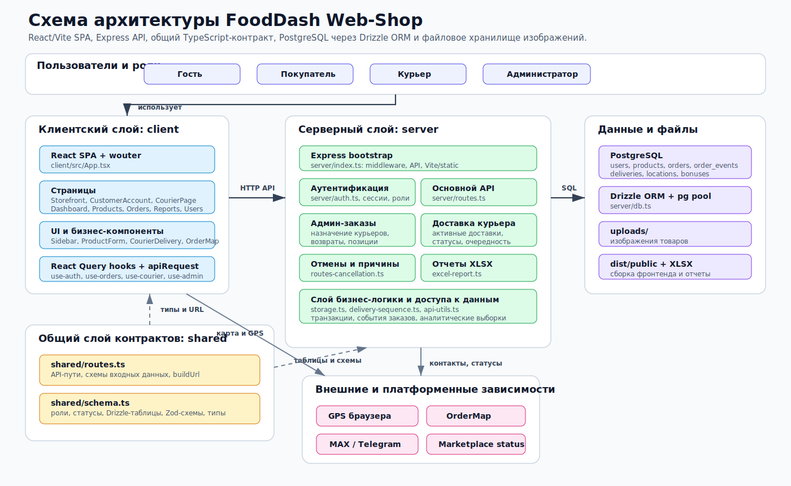
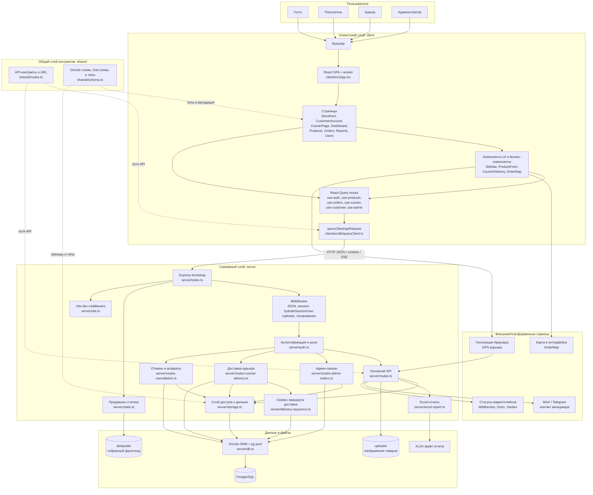
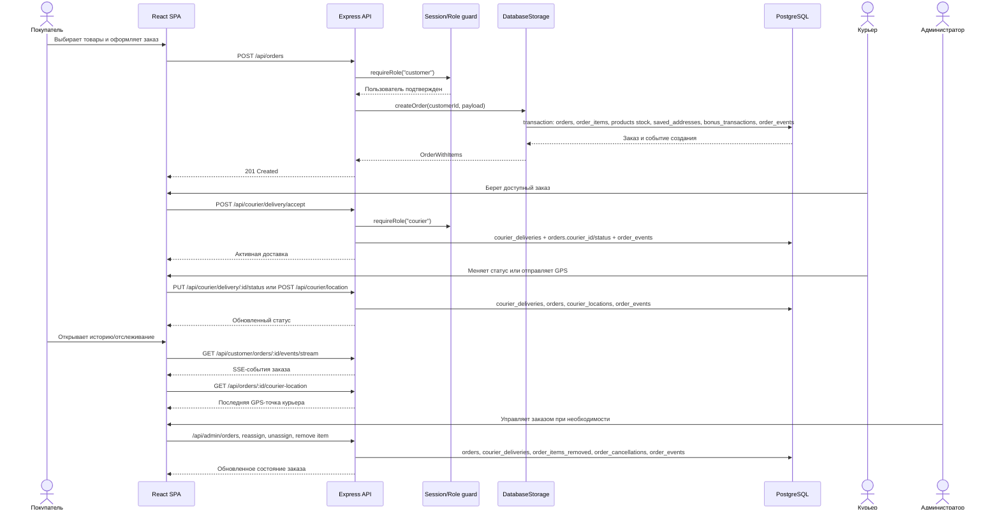
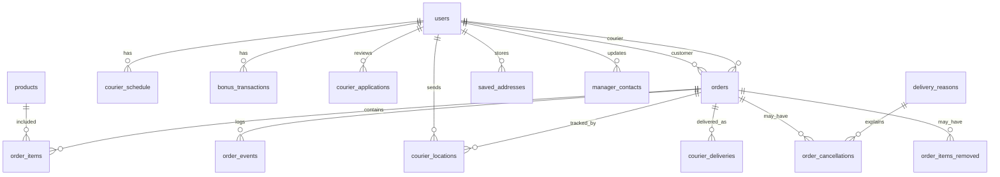

# Схема архитектуры приложения FoodDash Web-Shop

Документ описывает текущую архитектуру приложения по структуре проекта: клиентская часть React/Vite, сервер Express, общий слой типов и схем, PostgreSQL через Drizzle ORM, файловое хранилище изображений и модули заказов/доставки.

Готовая SVG-схема находится в файле [architecture-diagram.svg](architecture-diagram.svg). Ниже оставлены Mermaid-версии схем, чтобы их было удобно редактировать в Markdown.

## Общая схема

## Поток оформления и доставки заказа

## Зоны ответственности

| Зона | Основные файлы | Назначение |
| --- | --- | --- |
| Клиентское приложение | `client/src/App.tsx`, `client/src/pages/*`, `client/src/components/*` | Маршрутизация, экраны витрины, личного кабинета, панели курьера и админ-панели. |
| Клиентский доступ к API | `client/src/hooks/*`, `client/src/lib/queryClient.ts` | Запросы через React Query, мутации, кэширование и обновление интерфейса. |
| Общие контракты | `shared/schema.ts`, `shared/routes.ts` | Типы ролей, статусов, таблиц, Zod-валидация и константы API-путей. |
| Запуск сервера | `server/index.ts` | Express-приложение, middleware, сессии, загрузка API, Vite dev server или production static. |
| Безопасность | `server/auth.ts` | Cookie-сессии, хэширование паролей, проверка авторизации и ролей. |
| Основной API | `server/routes.ts` | Авторизация, пользователи, товары, заказы, кабинет покупателя, бонусы, график, GPS, аналитика, чат. |
| Управление заказами | `server/routes-admin-orders.ts`, `server/routes-cancellation.ts` | Назначение курьеров, отмены, возвраты, удаление позиций, причины отмен. |
| Доставка | `server/routes-courier-delivery.ts`, `server/delivery-sequence.ts` | Активные доставки курьера, очередность маршрута, статусы доставки, ограничения до 3 активных доставок. |
| Доступ к данным | `server/storage.ts`, `server/db.ts` | Транзакции, CRUD-операции, аналитические выборки, подключение к PostgreSQL. |
| Отчеты и файлы | `server/excel-report.ts`, `uploads/`, `dist/public` | Генерация XLSX-отчетов, хранение изображений, раздача production-сборки. |

## Основные сущности базы данных

Ключевая идея архитектуры: клиент работает как единое SPA-приложение, сервер предоставляет REST/SSE API с ролевой защитой, а бизнес-логика заказов и доставки фиксируется транзакциями PostgreSQL и событиями `order_events`.
