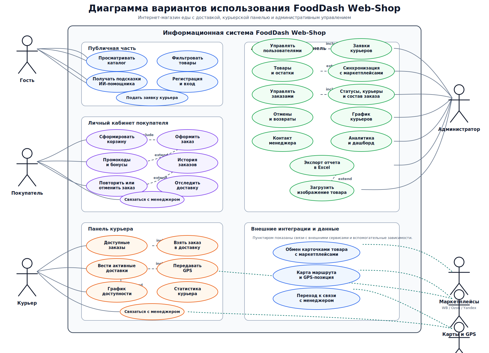
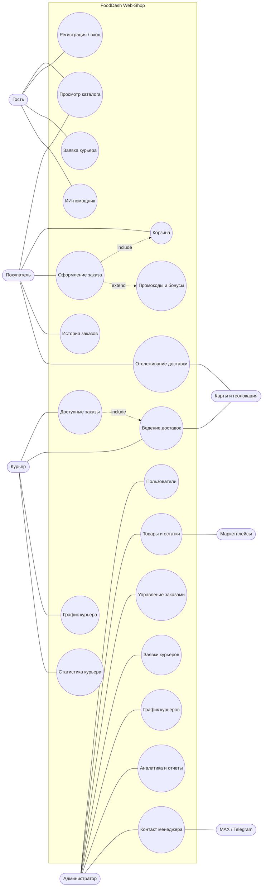

# Диаграмма вариантов использования FoodDash Web-Shop

Готовый SVG-рисунок находится в файле [use-case-diagram.svg](use-case-diagram.svg). Редактируемый UML-исходник находится в файле [use-case-diagram.puml](use-case-diagram.puml). Его можно открыть в PlantUML-плагине для IDE или отрендерить командой:

```bash
plantuml docs/use-case-diagram.puml
```

Диаграмма составлена по текущей структуре проекта: маршрутам приложения, серверным API, ролям из схемы БД и реализованным страницам.



## Акторы

- **Гость**: просматривает каталог, использует ИИ-помощника, регистрируется, входит в систему, подает заявку на роль курьера.
- **Покупатель**: оформляет заказ, применяет промокоды и бонусы, смотрит историю, повторяет и отменяет заказы, отслеживает доставку на карте.
- **Курьер**: берет заказы в доставку, ведет активные доставки, меняет их статус, передает GPS-координаты, заполняет график и смотрит статистику.
- **Администратор**: управляет пользователями, товарами, заказами, заявками курьеров, графиком курьеров, контактами менеджера, аналитикой и отчетами.
- **Внешние системы**: маркетплейсы, сервис карт и геолокации, мессенджер для связи с менеджером.

## Mermaid-обзор



## Источники в проекте

- `shared/schema.ts`: роли пользователей, статусы заказов, таблицы заказов, бонусов, доставок, заявок курьеров и GPS-локаций.
- `client/src/App.tsx`: маршруты витрины, профиля покупателя, панели курьера и административной панели.
- `server/routes.ts`, `server/routes-admin-orders.ts`, `server/routes-courier-delivery.ts`, `server/routes-cancellation.ts`: серверные сценарии для авторизации, заказов, товаров, аналитики, курьеров и отмен.
- `client/src/pages/*` и `client/src/components/*`: реализованные пользовательские экраны.
